<div align="center">


<br>

<a href="https://climate-dashboard-story.streamlit.app/"></a>
<a href="https://github.com/rajanithii/CLIMATE-DASHBOARD"></a>

<br>


<br>


</div>

<br>

<div align="center">

## Climate change is easier to see than to read.

</div>

<div align="center">
</div>

<p align="center">
ClimatePulse takes the climate datasets bundled with the project and turns them<br>
into interactive maps, charts and animations — built with Python, Pandas, Plotly and Streamlit.
</p>

<br>

<div align="center">
</div>

<p align="center"><sub>Five pages, one top navigation bar. Click any card to open the live dashboard.</sub></p>

<table>
<tr>
<td width="50%"><a href="https://climate-dashboard-story.streamlit.app/"></a></td>
<td width="50%"><a href="https://climate-dashboard-story.streamlit.app/"></a></td>
</tr>
<tr>
<td width="50%"><a href="https://climate-dashboard-story.streamlit.app/"></a></td>
<td width="50%"><a href="https://climate-dashboard-story.streamlit.app/"></a></td>
</tr>
</table>

<p align="center"><sub>These cards are illustrations generated from the bundled datasets to echo each page. They are <b>not</b> screenshots of the app.</sub></p>

<details>
<summary><b>What's on each page</b> (verified against the source)</summary>

<br>

| Page | What you can explore |
| :-- | :-- |
| 🏠 **Home** | Headline figures drawn from the data, four topic cards that open each dashboard, and a short static "Prevention & Action" section. |
| 🏭 **CO₂** | KPI cards · animated choropleth world map with a play button · top-10 emitters in the latest year · global total over time · top-5 emitters compared. |
| 🌡️ **Temperature** | KPI cards · warming stripes (hover for year and value) · annual points with a 10-year rolling mean and a linear projection to 2060 · decade averages · anomaly gauge · average temperature by country since 1980. |
| 🌊 **Sea Level** | KPI cards · observed series with a linear projection to 2100 · rate of rise per 5-year period · cumulative rise. The page also has contextual scenario panels that use fixed reference figures written into the page, not values from the dataset. |
| 🌳 **Forest** | KPI cards · "deforestation clock" (average annual loss as km² per hour and per second) · animated country bar race · global loss per year with a 3-year trend · estimated CO₂ released · top-10 countries · top-5 over time · share-by-country donut. |

</details>

> [!NOTE]
> **About the projections.** The dotted lines on the Temperature (to 2060) and Sea Level (to 2100) pages are simple statistical trend lines — a scikit-learn `LinearRegression` fitted to the loaded data, with a ±2σ band from its residuals. They show where the existing trend would continue. They are **not climate-model forecasts**.

<br>

<div align="center">
</div>

<details>
<summary><b>Technical details — architecture, navigation, projections</b></summary>

<br>

**Architecture**

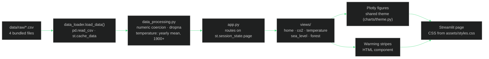

**Navigation**

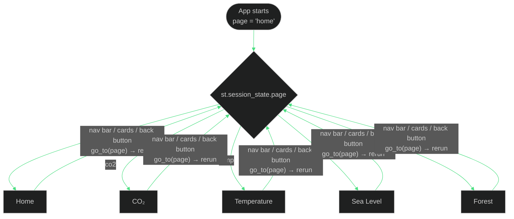

**Data preparation** (`climate_dashboard/data_processing.py`)

- Numeric columns are coerced with `pd.to_numeric(errors="coerce")`, and rows that fail are dropped. The input frame is copied, not mutated.
- Temperature rows are averaged per year, and only years ≥ 1900 are kept for the yearly series. The raw rows are kept for the by-country map.
- These functions are covered by three `pytest` tests in `tests/test_data_processing.py`.

**Projection method** (Temperature and Sea Level pages)

- An ordinary least-squares line is fitted on *year → value* for the whole loaded series.
- The line is extended to 2060 (temperature) or 2100 (sea level).
- The shaded band is the projection ± 2 × the standard deviation of the fit's residuals.
- The Temperature page also draws a dashed reference line at *baseline + 1.5 °C*, where the baseline is the mean of the yearly values up to 1950.
- The app's legend labels the projected line "ML Projection". It is a linear trend line, as described above.

</details>

<br>

<div align="center">
</div>

<table>
<tr>
<td width="50%" valign="top">

**Tech stack**

| Tool | Role |
| :-- | :-- |
| **Python** | Application logic |
| **Streamlit** | The web app: pages, navigation, caching |
| **Pandas** | Loading, cleaning, aggregation |
| **Plotly** | Maps, animated frames, bars, lines, gauge, donut |
| **NumPy** | Year ranges, projection band |
| **scikit-learn** | `LinearRegression` trend lines |
| **pytest** | Tests for the data-processing functions |

</td>
<td width="50%" valign="top">

**The data** — bundled in `data/raw/`

| File | Coverage |
| :-- | :-- |
| `data_test.csv` | Monthly temperature · 1743–2024 · 250 countries/territories · 760,175 rows |
| `co2_sample_dataset.csv` | CO₂ · 1960–2023 · 12 countries |
| `sea_level_large.csv` | Sea level · 1990–2023 · 34 yearly rows |
| `forest_large.csv` | Forest loss · 1990–2023 · 10 countries |

</td>
</tr>
</table>

ClimatePulse visualizes **only these bundled files**: there is no live feed and no data input in the interface. The repository doesn't document where the datasets originally came from, so no source is claimed here. Rankings and totals (e.g. "top emitter") describe the countries present in these files, not the whole world.

<details>
<summary><b>Project structure</b></summary>

<br>

```text
ClimatePulse
│
├── app.py                        entry point: page config, data loading, routing
│
├── climate_dashboard/
│   ├── data_loader.py            reads the four CSVs (cached)
│   ├── data_processing.py        cleaning + aggregation helpers
│   ├── styles.py                 injects assets/styles.css
│   ├── charts/theme.py           shared dark Plotly layout
│   ├── components/
│   │   ├── navigation.py         top nav bar + page switching
│   │   └── warming_stripes.py    warming stripes as HTML
│   └── views/                    one module per page
│       ├── home.py
│       ├── co2.py
│       ├── temperature.py
│       ├── sea_level.py
│       └── forest.py
│
├── data/raw/                     bundled datasets
├── assets/styles.css             dashboard styling
├── docs/readme/                  SVG artwork used by this README
├── tests/                        pytest tests for data processing
│
├── requirements.txt
└── requirements-dev.txt          adds pytest
```

</details>

<br>

<div align="center">
</div>

```bash
git clone https://github.com/rajanithii/CLIMATE-DASHBOARD.git
cd CLIMATE-DASHBOARD

python -m venv .venv

# Windows (PowerShell: .venv\Scripts\Activate.ps1)
.venv\Scripts\activate

# macOS / Linux
source .venv/bin/activate

pip install -r requirements.txt
streamlit run app.py
```

<details>
<summary><b>Run the tests</b></summary>

```bash
pip install -r requirements-dev.txt
pytest
```

</details>

<br>

<div align="center">

<a href="https://climate-dashboard-story.streamlit.app/"></a>

<br>

Built by **[Rajanithi N](https://github.com/rajanithii)**

</div>
